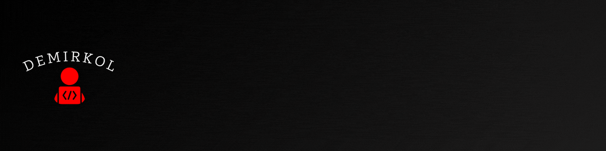
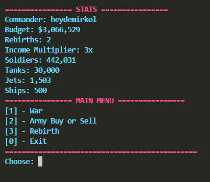

<p align="center">
  
</p>

---

# ► **DESCRIPTION**

This game is a military simulator in which the player takes on the role of a commander. The goal is to build and manage an army, make tactical decisions, and grow stronger through battles over time.

The player can recruit and sell different types of military units such as soldiers, tanks, jets, and ships, each with different costs and strengths. Careful resource management is required, as every purchase and sale directly affects the commander’s budget and overall army power.

The game includes a rebirth system that allows the player to reset their progress in exchange for a permanent increase in income multiplier. This creates a long-term progression loop where each reset makes future runs more profitable.

Smart investments, efficient army management, and strategic planning are essential to dominate battles and maximize income over time.

---

# ► **DISCLAIMER**

This project is created for educational and learning purposes only and is intended for personal study, research, and technical demonstration. It is not designed or suitable for production, commercial, or critical systems. It is recommended that you review the source code before using this project. By using this project, you agree that you are fully responsible for any risks or consequences arising from its use, and the project owner shall not be held liable for any damages, losses, or issues resulting from its use or misuse.

---

# ► **PREVIEW**

<p align="left">
  
</p>

---

# ► **REQUIREMENTS**

> ​​☕​ Before building the project, make sure the following tools are installed:

- **CMake** 3.16 or newer
- **C++11 or higher** compatible compiler and standard
- **Git** (for cloning the repository)
- A **terminal** environment

> ​☕ Supported compilers include: 

- **GCC**
- **Clang**
- **MSVC** (Visual Studio)

# ► **SUPPORTED PLATFORMS**

> ☕​ ​This project is fully **cross-platform**.

- **Windows** (using MSVC or MinGW)
- **Linux** (using GCC or Clang)
- **macOS** (using Apple Clang or GCC)

# ► **INSTALLATION**

> ☕ Clone the repository first:

```terminal
git clone https://github.com/heydemirkol/WarSimulator.git
cd WarSimulator
```
---

# ► **BUILD**

> ☕ From the project root, create and enter a `build` directory:

### LINUX / MACOS

```terminal
mkdir -p build
cd build
```

### WINDOWS

```terminal
mkdir build
cd build
```

> ☕ Configure **CMake** within the `build` directory:

```terminal
cmake ..
```

> ☕ Build the project:

```terminal
cmake --build .
```

> ☕ After a successful build:

### LINUX / MACOS

```terminal
./WarSimulator
```

### WINDOWS

```terminal
.\WarSimulator.exe
```

---

# ► **CLEAN REBUILD**

> ☕ If you encounter build issues or want to start from a clean state,
> ☕ you can remove the existing `build` directory and reconfigure the project from scratch:

### LINUX / MACOS 

```terminal
cd .. && rm -rf build
```

### WINDOWS

```terminal
cd .. && rmdir /s /q build
```

> ☕ After cleaning, rebuild the project...

---

# ► **INFORMATION**

For more information about the project and to review the documentation, please refer to the `docs/` directory, which includes project images, troubleshooting, system architecture, and coding style guidelines.

---

# ► **AUTHOR**

Developed by **Abdüsselam Demirkol**

Github: **heydemirkol**

Date published: **26 June, 2026**
