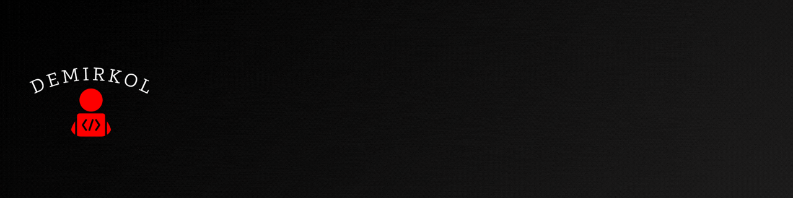

  

---

# ► **DESCRIPTION**

This document shows the overall structure of the game and how it works.

---

# ► **ARCHITECTURE** 

The game begins with a new commander stepping onto the battlefield. Before any decisions are made, the system asks the player for a nickname and creates the main game objects: Army, Commander, Multiplier, and Rebirth. These objects become the foundation of the entire game, each responsible for a specific part of the simulation. As a welcome gift, the commander receives an initial budget, allowing the player to immediately explore the game's mechanics.

Every purchase first verifies that the commander has enough money before updating both the budget and the army inventory. Selling follows a similar validation process, ensuring that the player actually owns the requested number of units before converting them back into money. 

Overall, the architecture follows a centralized game controller model. The main() function coordinates the interaction between the classes, while each class manages its own responsibilities. This modular design improves readability, reduces code duplication, and makes future expansion—such as adding new unit types, battle systems, upgrades, or game mechanics—straightforward without requiring major changes to the overall structure.
